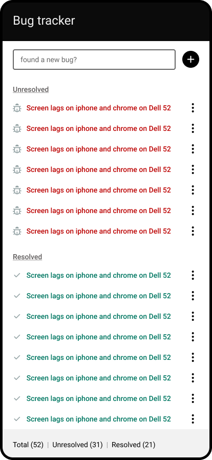
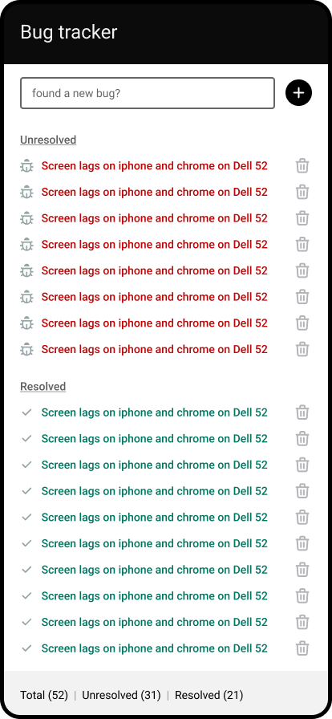

## Redux [Aha moment 🥰]

we store our app state inside a single js object called the store. It's the single source of truth

```js
store = {
  categories: [],
  products: [],
  cart: {},
  user: {},
};

// it's up to you whether you want to use array, object, boolean etc
```

> You can't mutate the state

```js
store.user = { name: "Ridwan Opebe" }; // nah!!!
```

> to update our store, we need a reducer

### Reducer

reducer is a function that takes the current instance of the store (state) and return the updated store (udpated state)

```js
function reducer(store) {
  // return updated store
  updated = { ...store };
  // use spread (and be conscious about issues around it)
  // or use one of the immutability libraries preferably immer
}
```

#### so how does reducer know what to update???

yeah, that's where action comes in

```jsx
function reducer(store, action) {
  // update
}
// we can have a single reducer or have a reducer for each object in the store
```

### Redux is made up of

- Action (kind of like events) e.g ADD_TO_CART
- Store
- Reducer (kind of event handlers)

### How Redux works

```websequencediagrams.com
title How Redux works

Action->Store: Actions are dispatched to the store
Store->Reducer: Store calls the reducer
Reducer-->Store: Makes the change and commits (return) it to the store
note over Action: Actions are like events that happens in our application
note over Store: a JS object that maintain our app state
note over Store: our single source of truth
note over Store: Our entire UI/React App depends soley on the store to render everything you're seeing that could change
```

## Bug Tracker



